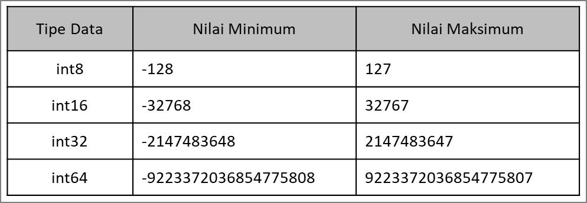
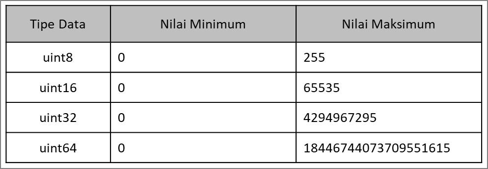
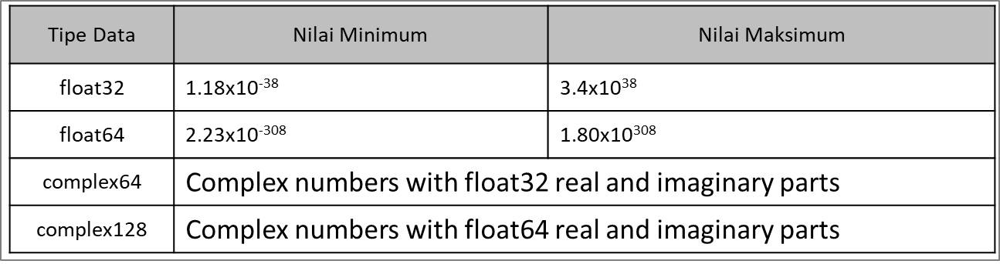
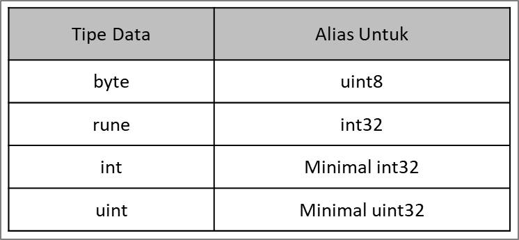

# Tipe Data Number

- Ada dua jenis tipe data Number, yaitu:
  - Integer
  - Floating Point

## Tipe Data Integer (1)

- tipe data integer
  

## Tipe Data Integer (2)

- tipe data integer unsigned
- atau bisa dikatakan tidak ada nilai negatif
  

## Tipe Data Floating Point

- tipe data floating point atau mengandung nilai pecahan (koma)
  

## Tipe Data Alias

- tipe data alias
  
