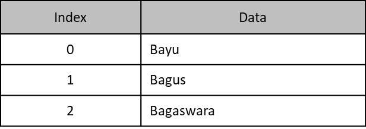
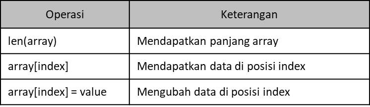

# Tipe Data Array

- Array adalah tipe data yang berisikan kumpulan data dengan tipe yang sama
- Saat membuat array, kita perlu menentukan jumlah data yang bisa ditampung oleh Array tersebut
- Daya tampung Array tidak bisa bertambah setelah Array dibuat

  

## Membuat Array Langsung

- Di Go-Lang kita juga bisa membuat Array secara langsung saat deklarasi variable

- function di array

  
