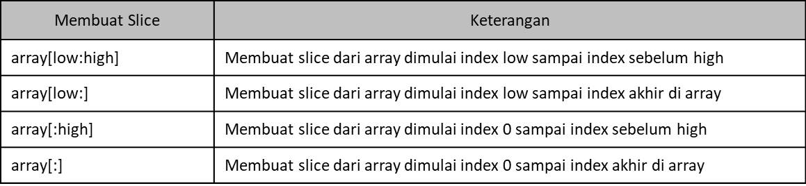
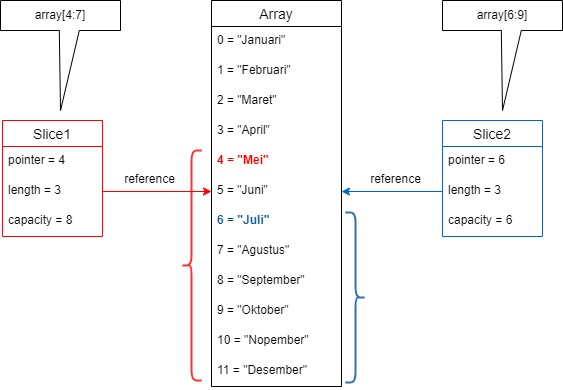
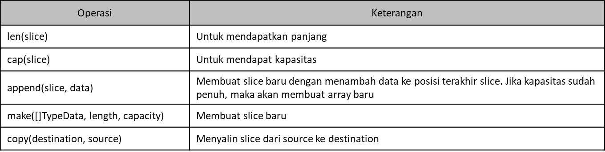

# Tipe Data Slice

- Tipe data Slice adalah potongan dari data Array
- Slice mirip dengan Array, yang membedakan adalah ukuran Slice bisa berubah
- Slice dan Array selalu terkoneksi, dimana Slice adalah data yang mengakses sebagian atau seluruh data di Array
- Slice adalah reference elemen array. Slice bisa dibuat, atau bisa juga dihasilkan dari manipulasi sebuah array ataupun slice lainnya.
- Karena merupakan data reference, maka perubahan data di tiap elemen slice akan berdampak pada slice lain yang memiliki alamat memori yang sama

## Detail Tipe Data Slice

- Kalau di array kita hanya mempunyai `length` saja
- tapi di tipe data slice kita memiliki 3 data, yaitu `pointer`, `length`, dan `capacity`
- `Pointer` adalah penunjuk data pertama di array pada slice. Jadi ini adalah acuan data pada arraynya
- `Length` adalah panjang dari slice
- `Capacity` adalah kapasitas dari slice, dimana length tidak boleh lebih dari capacity

- Membuat Slice dari Array

  

- Slice dan Array

  

- Function di Slice

  

- Hati-hati saat membuat Array. Jika salah, maka yang kita buat bukanlah Array, melainkan Slice
