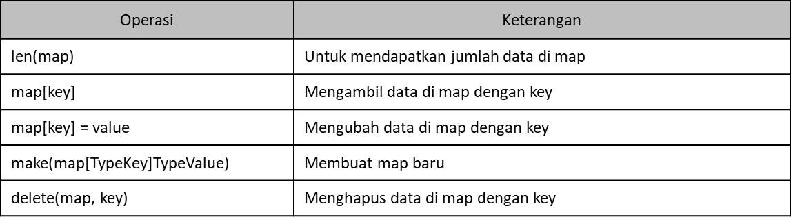

# Tipe Data Map

- Pada Array atau Slice, untuk mengakses data, kita menggunakan index Number yag dimulai dari `index-0`
- Map adalah tipe data lain yang berisikan kumpulan data yang sama. Namun kita bisa menentukan jenis tipe data index yang akan kita gunakan
- Sederhananya, Map adalah tipe data kumpulan `key-value` (kata kunci-nilai). Dimana kata kuncinya bersifat unik, tidak boleh sama
- Berbeda dengan Array dan Slice, jumlah data yang kita masukkan ke dalam Map boleh sebanyak-banyaknya, asalkan kata kunci nya berbeda. Jika kita gunakan kata kunci sama, maka secara otomatis data sebelumnya akan diganti dengan data baru
- Function di Map

  
