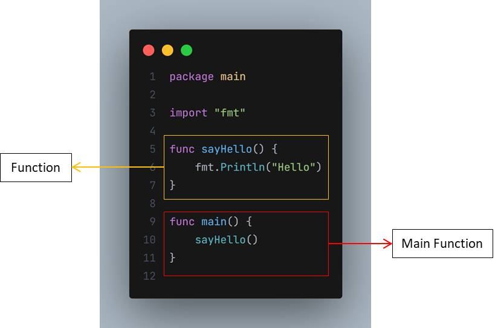

# Function

- Sebelumnya kita sudah mengenal sebuah function yang wajib dibuat agar program kita bisa berjalan atau dieksekusi, yaitu bernama `main function`
- `Function` adalah sebuah blok kode yang sengaja dibuat dalam program agar bisa digunakan berulang-ulang
- Cara membuat function sangat sederhana, hanya dengan menggunakan kata kunci `func` lalu diikuti dengan nama function nya dan blok kode isi functionnya
- Setelah membuat function, kita bisa mengeksekusi function tersebut dengan cara memanggilnya menggunakan kata kunci nama function nya, lalu diikuti tanda kurung buka dan kurung tutup

  
