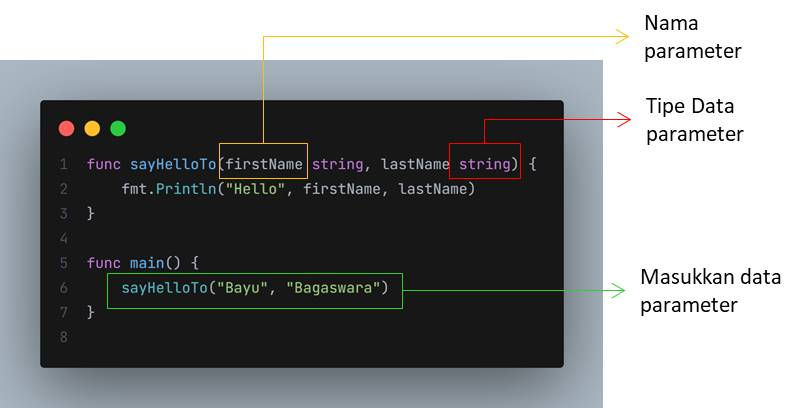

# Function Parameter

- Saat membuat function, kadang-kadang kita membutuhkan data dari luar, atau kita sebut parameter
- Kita bisa menambahkan parameter di function, dan bisa lebih dari satu parameter
- Parameter tidaklah wajib
- Jadi kita bisa membuat function tanpa parameter seperti sebelumnya yang sudah kita buat
- Namun, jika kita menambahkan parameter di function, saat ketika memanggil function tersebut, maka kita wajib memasukkan data ke parameternya

  
