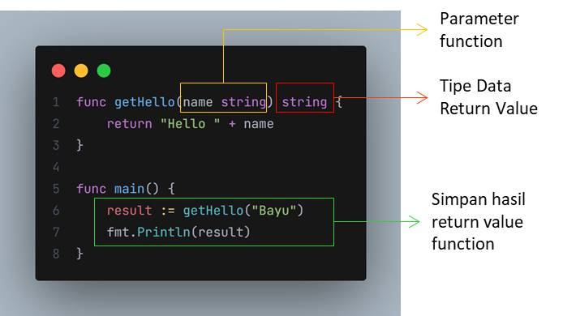

# Function Return Value

- Function itu bisa mengembalikan sebuah data. Atau bisa dikatakan saat kita mengeksekusi function tersebut, maka akan menghasilkan data baru, yang nantinya data tersebut akan kita gunakan
- Untuk memberitahu bahwa function mengembalikan data, maka kita harus menuliskan `tipe data kembalian` dari function tersebut
- Jika function tersebut kita deklarasikan dengan tipe data pengembalikan, maka wajib di dalam function nya kita harus mengembalikan data
- Untuk mengembalikan data dari function, kita bisa menggunakan kata kunci return, diikuti dengan datanya

  
