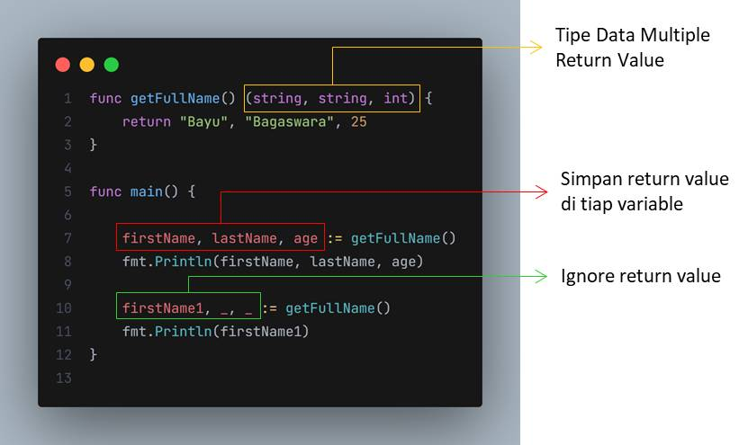

# Returning Multiple Values

- Function tidak hanya dapat mengembalikan satu value, tapi juga bisa multiple value
- Untuk memberitahu jika function tersebut mengembalikan multiple value, maka kita harus menulis semua tipe data untuk return value nya di function

## Menghiraukan Return Value

- Multiple return value `wajib` ditangkap semua value nya
- Jika kita ingin menghiraukan return value tersebut, kita bisa menggunakan tanda `_` atau garis bawah

  
