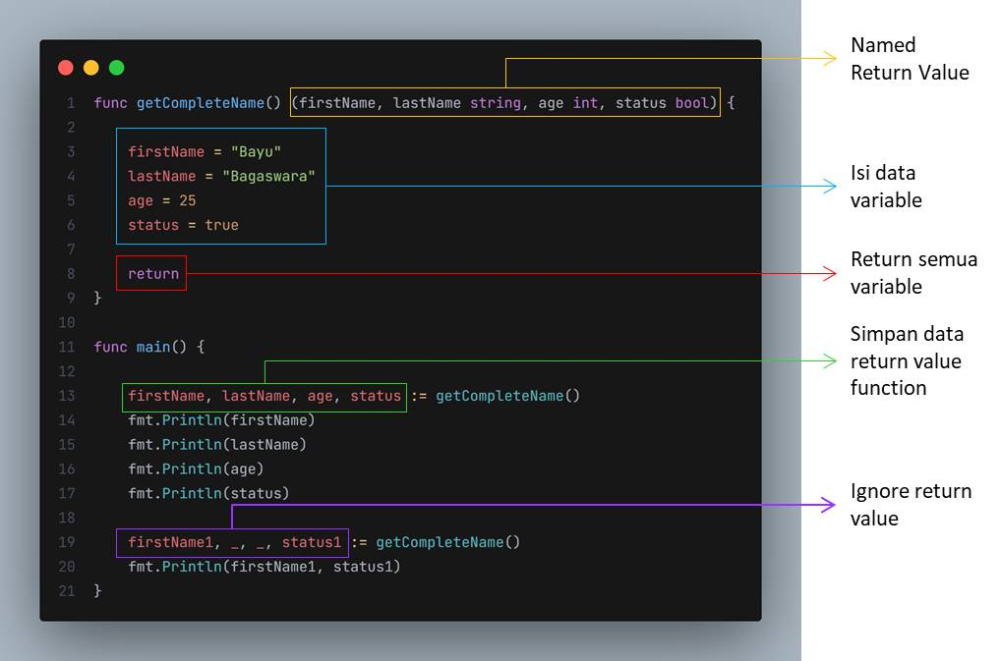

# Named Return Value

- Biasanya saat kita memberi tahu bahwa sebuah function mengembalikan value, maka kita hanya mendeklarasikan tipe data return value di function
- Namun, kita juga bisa` membuat variable secara langsung di tipe data return function` nya
- Jadi di tipe data return sebuah function, kita bisa menambahkan sebuah name variable

  
