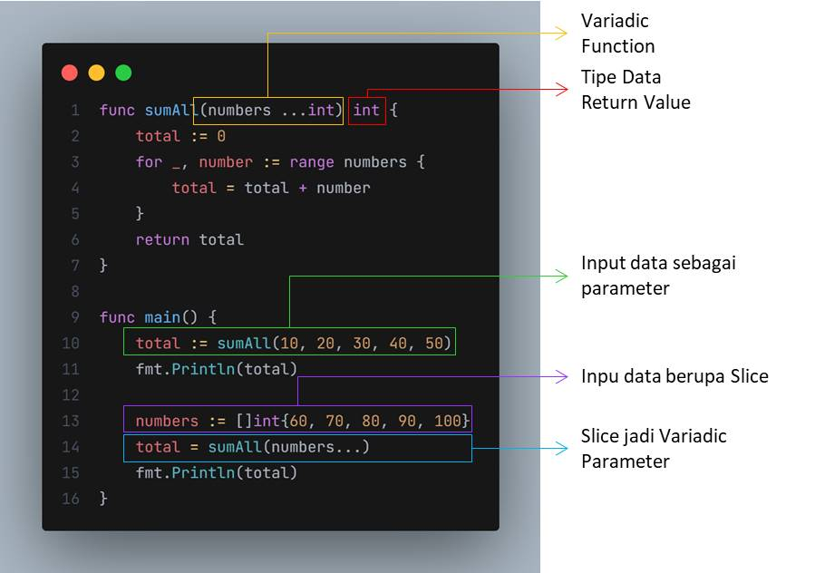

# Variadic Function

- Parameter yang berada di posisi terakhir, memiliki kemampuan untuk dijadikan sebuah `varargs`
- `Varargs` artinya datanya bisa menerima lebih dari satu input, atau anggap saja semacam Array
- Apa bedanya dengan parameter biasa dengan tipe data Array?
  - Jika parameter tipe Array, maka kita wajib membuat Array terlebih dahulu sebelum mengirimkan ke function
  - Jika parameter menggunakan varargs, maka kita bisa langsung mengirim data nya. Jika lebih dari satu, maka cukup gunakan tanda koma

## Slice Parameter

- Kadang ada kasus, dimana saat kita menggunakan Variadic Function, tetapi memiliki variable berupa slice
- Kita bisa menjadikan slice sebagai `vararg parameter`

  
